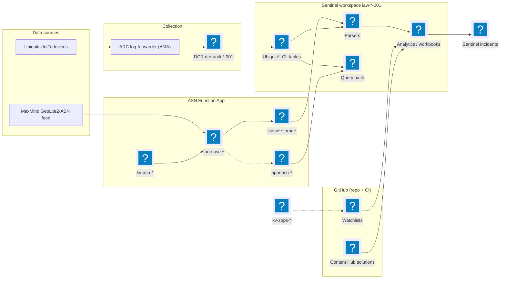

# Azure Sentinel Setup in Terraform

Deployment for Azure Sentinel via Terraform

Well for now it is just a LAW, the plan is to upgrade to Sentinel

## Required permissions

### CI service principal (GitHub Actions, OIDC)

Azure RBAC on the target subscription / resource groups:

- **Contributor** on `rg-log-neu-01` — create the workspace, DCRs, function app,
  storage, Key Vaults, Logic App, automation rules, etc.
- **Role-assignment write** (e.g. *Role Based Access Control Administrator* or
  *User Access Administrator*) for this repo's `azurerm_role_assignment`
  resources. If that permission is ABAC-conditioned, the condition must allow the
  roles assigned here — including **Microsoft Sentinel Automation Contributor**
  and **Microsoft Sentinel Responder**.
- **Storage Blob Data Contributor** on the Terraform state storage account.

Microsoft Graph **application** permissions, admin-consented on the CI app
registration in Entra:

- **`CustomDetection.ReadWrite.All`** — deploy/manage Defender XDR custom
  detection rules (`detection_rules.tf`).
- **`ThreatHunting.Read.All`** — run advanced hunting queries (detection-rule
  testing).

> These Graph permissions can't be bootstrapped from Terraform — the CI
> principal can't read or modify app registrations — so grant and
> **admin-consent them in the Entra portal**.

### Microsoft Sentinel

- The **Azure Security Insights** first-party service principal needs
  **Microsoft Sentinel Automation Contributor** on `rg-log-neu-01` so automation
  rules can run the Discord notification playbook (*Microsoft Sentinel →
  Settings → Manage playbook permissions*).

## Architecture

> Uses Mermaid flowchart *icon* node shapes with iconify icons. GitHub's
> built-in Mermaid renderer does **not** load external icon packs, so the icons
> only appear in environments that register them (e.g. mermaid.live, or docs
> sites with `mermaid.registerIconPacks([...])` for `@iconify-json/logos`).




### Custom tables

Use the script `createLogDeclaration.sh` to generate a table declaration for a custom log.

Example use:

```sh
./createLogDeclaration.sh "TimeGenerated, Computer, Message"
```

Output:

```json
[
    {
        "name": "TimeGenerated",
        "type": "enter_type",
        "desription": "enter_description"
    },
    {
        "name": "Computer",
        "type": "enter_type",
        "desription": "enter_description"
    },
    {
        "name": "Message",
        "type": "enter_type",
        "desription": "enter_description"
    }
]
```

**Custom table for Unifi Firewall logs**

UnifiLogs_CL

UnifiFirewallLogs_CL

### Sentinel codeless connectors (CCF)

Codeless connectors are deployed directly with the `azapi` provider via the
`IaC/modules/codeless_connector` module (data connector definition + RestApiPoller
connections) — no ARM solution template or Content Hub install step. The DCR, DCE
and output tables they bind to are created by their own modules and passed in.

When authoring a connector definition or poller, the **Microsoft Sentinel RM REST
API** is the authoritative reference for the resource body and exactly which fields
are required — the prose CCF docs and the REST API model sometimes disagree, so
trust the REST API:

- Operation groups: <https://learn.microsoft.com/rest/api/securityinsights/operation-groups>
- Data connectors (RestApiPoller): <https://learn.microsoft.com/rest/api/securityinsights/data-connectors/create-or-update>

### Logger service

`logger`is a program for logging logs to a LAW. Source file is in: `/logger/go/logger.go`.


#### Features:

- Can log generic data via tailing a file
- Can filter logs via regex
- Easy to create a service to automaticly start the program

#### Usage

logger example usage. 
`logger -file <file to log> -creds <file with creds> -log_type <log type> -regex <regex log filter> -endpoint <data collection endpoint> -stream <stream name> -id <immutable dcr id>`

You can also specify a settings file instead `logger -conf <config file path>`


An example of a logger config file:

```
FILE=../test.log
LOG_TYPE=Custom
REGEX=.*logg:
ENDPOINT=https://dce-url.ingest.monitor.azure.com
STREAM=Custom-StreamName_CL
ID=dcr-3d02c6b893244843b80544e8c844dac6
CREDS=../logger.creds
```
Note: Do not encapsulate the different settings with quotes.

**Authentication**

If you dont specify a credential file with the `-creds` flag then the program will try to authenticate with [`DefaultAzureCredentials`](https://pkg.go.dev/github.com/Azure/azure-sdk-for-go/sdk/azidentity#DefaultAzureCredential).


Otherwise use a credentials file. With a syntax like this:

```
AZURE_TENANT_ID=<tenant_id>
AZURE_CLIENT_ID=<client id>
AZURE_CLIENT_SECRET=<client_secret>
```

#### How to use

Build the program for your system with `go build logger`. Copy the file to `/opt/logger/bin/` (this path is hardcoded in the service if you want to use another path, modify the logger.service file).

Create a `logger.conf` file in `/opt/logger/logger.conf`

Create a logger user with `sudo useradd -M -s /sbin/nologin loggeruser`

Copy the `logger.service` file to `/etc/systemd/system/`

Reload systemctl `sudo systemctl daemon-reload`

Start the logger service `sudo systemctl start logger`


### TODO

- ~~Change to a Sentinel workspace~~
- Create some KQL queries
- ~~Fix a Go program for logging and create a linux service for it~~
- Fix a pipeline for deployment
- Move DCR to separate file, and try to make it less anoying to work with